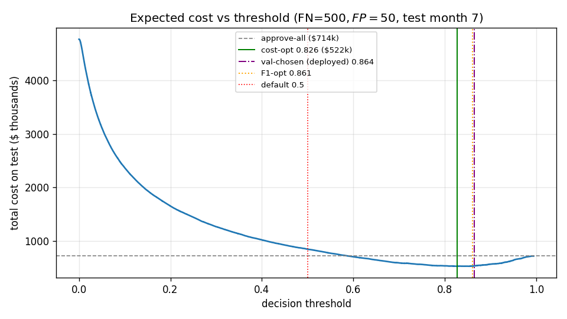
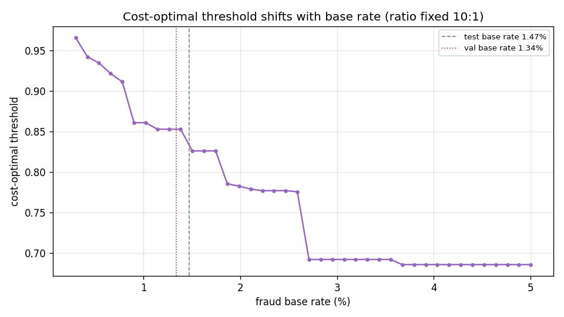

# Cost-Sensitive Threshold Analysis (Phase 1, Step 8)

**The core idea:** a fraud model outputs a *score*; the business decision is *where to
cut it*. That cut should minimize **expected dollar cost**, not maximize F1 or sit at an
arbitrary 0.5 — because in fraud the two error types are not equally expensive.

**Model & protocol (consistent with the shipped artifact):** LightGBM trained on
**train (months 0–5)**; the operating threshold is the cost-optimal cut chosen on
**val (month 6)**; everything below is measured on the **sealed test set (month 7)**.
The "oracle" rows pick the threshold directly on test — an upper bound, not deployable.

## Cost matrix (tunable; set in `ml/src/config.py`)

| Outcome | Cost | Why |
|---|---|---|
| **False Negative** — approve a fraud | **$500** | downstream fraud loss / chargebacks / remediation |
| **False Positive** — block a legit applicant | **$50** | manual-review labor + customer friction |
| True Positive / True Negative | $0 | correct decision |

**The 10:1 ratio drives everything.** Cost = `FN_count × $500 + FP_count × $50`.

## Test set
96,843 applications, 1,428 fraud (**1.475%**), 95,415 legit.

## Policy comparison (total cost on test)

| Policy | Threshold | Total cost | TP | FP | FN |
|---|---:|---:|---:|---:|---:|
| Approve everything (flag none) | — | $714,000 | 0 | 0 | 1,428 |
| Review everything (flag all) | — | $4,770,750 | 1,428 | 95,415 | 0 |
| Default 0.5 | 0.500 | $842,700 | 1,082 | 13,394 | 346 |
| F1-optimal (oracle) | 0.861 | $525,100 | 592 | 2,142 | 836 |
| **Val-chosen (DEPLOYED)** | **0.864** | **$528,050** | 580 | 2,081 | 848 |
| Cost-optimal (oracle) | 0.826 | $521,650 | 683 | 2,983 | 745 |

### What this shows
- **The default 0.5 threshold is actively harmful — $842,700, *worse* than approving
  everything ($714,000).** A class-balanced model centers its scores near 0.5, so 0.5
  flags 13,394 cases and the false-alarm bill swamps the fraud caught. The single best
  argument against eyeballing a threshold.
- **The deployed threshold (0.864, chosen on val) lands within $6,400 of the test oracle
  ($521,650).** That small gap is the *price of honesty + drift*: we picked the cut without
  touching test, and val's lower fraud rate (1.34%) pushes the cut slightly too high for
  the higher-fraud test month (oracle 0.826) — see base-rate section.
- **Cost-optimal vs F1 at 10:1 is close here ($3,450)** — and that is worth being honest
  about. F1 is *cost-blind*: it fixes one threshold (0.861) regardless of the cost matrix.
  At our 10:1 ratio it happens to sit near the cost-optimal cut. That coincidence does not
  hold across cost ratios — see below.

## Cost-optimal vs F1 across cost ratios (the honest version)

F1's threshold is fixed at 0.861 no matter the costs; the cost-optimal threshold *moves*
with the ratio. The more the cost asymmetry departs from where F1 happens to align, the
more money F1 leaves on the table:

| FN:FP ratio | Cost-optimal threshold | Cost-optimal $ | F1 $ | F1 excess cost |
|---:|---:|---:|---:|---:|
| 2:1 | 0.966 | $137,350 | $190,700 | **+$53,350 (28%)** |
| 5:1 | 0.918 | $309,250 | $316,100 | +$6,850 (2%) |
| 10:1 | 0.826 | $521,650 | $525,100 | +$3,450 (0.7%) |
| 20:1 | 0.692 | $845,100 | $943,100 | **+$98,000 (10%)** |
| 50:1 | 0.461 | $1,507,900 | $2,197,100 | **+$689,200 (31%)** |

**The point isn't "we always save X%."** It's that the cost-optimal threshold is *principled
and adapts to the cost matrix*, while F1 is a fixed cut that only works by luck. Pick costs
away from F1's coincidental sweet spot and the gap is large.

## How the optimal threshold shifts with base rate

Holding the cost ratio at 10:1 and varying fraud prevalence:

| Base rate | Cost-optimal threshold |
|---:|---:|
| 0.50% | 0.935 |
| 1.00% | 0.861 |
| 1.34% (val) | 0.853 |
| **1.48% (test)** | **0.826** |
| 2.00% | 0.783 |
| 3.00% | 0.692 |
| 5.00% | 0.686 |

**Higher fraud prevalence → lower optimal threshold (flag more aggressively).** When fraud
is more common, any given score is more likely to be fraud, so it pays to flag at a lower
cut. (Computed from prevalence-independent FNR(t)/FPR(t) on the test scores — no resampling
noise.)

### Why this matters here specifically
Our **temporal split has built-in drift**: val prevalence ≈ 1.34%, test ≈ 1.48%. The
threshold chosen on val (0.864) is **too high** for the higher-fraud test month (oracle
0.826) — too conservative, missing fraud — and that is exactly the $6,400 deployed-vs-oracle
gap above. **The decision threshold is not a fixed constant; it must track the current base
rate.** A production system should re-estimate it as prevalence moves (a monitoring concern
for a later phase).

## Caveat: calibration
The theoretical Bayes-optimal threshold for a *calibrated* model is
`p* = C_FP / (C_FN + C_FP) = 0.091`. Our empirical optimum (~0.83) is far from it because
`class_weight="balanced"` distorts the probability scale (it trains as if classes were
balanced, inflating fraud scores). For decision-making this is harmless — we select the
threshold *empirically* on a held-out set, which is robust to miscalibration. If we ever
needed trustworthy probabilities (not just a good cut), we'd add probability calibration
(isotonic/Platt) — out of scope for Phase 1.
